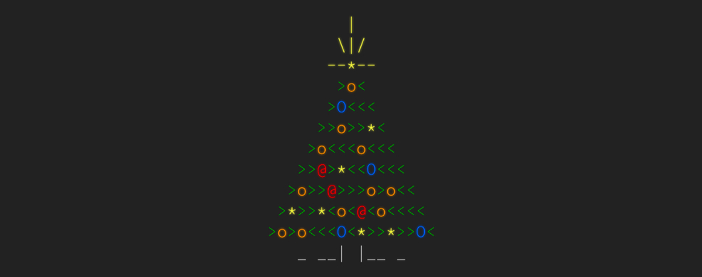

  

<h2 align="center" style="font-family:Bahnschrift,Segoe UI,sans-serif; font-weight:800;">
  Advent of Code Puzzle Database
</h2>

   This repository is an overview of my personal <a href="https://adventofcode.com">Advent of Code (AoC)</a> solutions,
   which are given in <a href="https://www.python.org">Python</a>.

---

🧠 About AoC
------------
[AoC][aoc-about] is an Advent calendar of small programming puzzles
for a variety of skill sets and skill levels that can be solved in any
programming language you like. People use them as interview prep, company training,
university coursework, practice problems, a speed contents, or to challenge each other.
Each year it starts on the 1st of December, releasing a new puzzle every day divided in
two parts (the second part is only unlocked after solving the first one). It is created by
[Eric Wastl][aoc-eric] and it is free, but if you want to support its creator, you can donate to him
here [here][aoc-support].

---
📚 Overview
-----------
- **AoC 2025**: [solutions][2025-sol]

[python-site]: https://www.python.org/
[aoc-site]:    https://adventofcode.com/
[aoc-about]:   https://adventofcode.com/2019/about
[aoc-eric]:    https://twitter.com/ericwastl
[aoc-support]: https://adventofcode.com/2019/support

[2025-sol]: solutions/2025/README.md